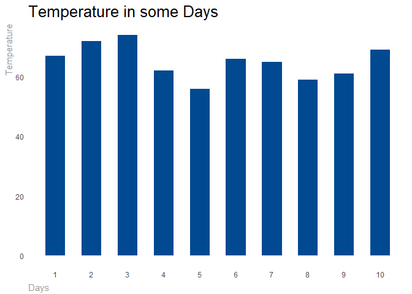

Data Visualization: Bars
================

``` r
library(data.table)
library(dplyr)

library(ggplot2)
library(scales)
library(formattable)
library(DT)
```

``` r
data <- head(airquality[, c("Day", "Temp")], 10)
```

``` r
# Create bar chart theme
theme_swd_bar <-   theme(
  plot.title = element_text(size = rel(1.75), color = "#000000"),
  text = element_text(color = "#979797"),
  axis.title.x = element_text(hjust = 0, vjust = -0.5),
  axis.title.y = element_text(hjust = 1),
  line = element_blank(),
  rect = element_blank()
)

# Properly format the commas while also removing the decimal places.
scaleFUN <- function(x) format(round(as.numeric(x), 0), nsmall=0, big.mark=",")

# Apply bar chart theme to the geom_bar
ggplot(data, aes(x = Day, y = Temp)) +
  geom_bar(stat="identity",
           fill = "#014991",
           width = .55) +
  scale_x_continuous(name = "Days",
                     breaks=seq(1, 10,1)) +
  scale_y_continuous(name = "Temperature",
                     breaks=seq(0,100,20),
                     label = scaleFUN) +
  labs(title = "Temperature in some Days") +
  theme_swd_bar
```


