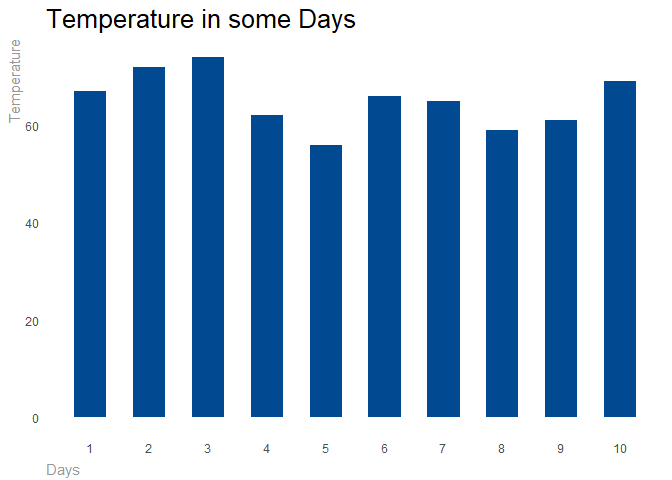

Data Visualization: Line Chart
================

``` r
library(data.table)
library(dplyr)

library(ggplot2)
library(scales)
library(formattable)
library(DT)
```

``` r
data <- head(airquality[, c("Day", "Temp")], 10)
```

``` r
# Create line chart theme
theme_swd_line <-   theme(
  plot.title = element_text(size = rel(1.75), color = "#000000"),
  plot.margin = margin(20, 20, 20, 20),
  text = element_text(color = "#979797"),
  axis.title.x = element_text(hjust = 0, vjust = -0.5),
  axis.title.y = element_blank(),
  axis.text.y = element_blank(),
  line = element_blank(),
  rect = element_blank()
)

# Properly format the commas while also removing the decimal places.
scaleFUN <- function(x) format(round(as.numeric(x), 0), nsmall=0, big.mark=",")

# Apply line chart theme to geom_line
ggplot(data, aes(x = Day, y = Temp)) +
  geom_line(size = 1, color = "#014991") +
  scale_x_continuous(name = "DAY",
                     breaks=seq(0, 10,1),
                     expand = c(0, 0)) +
  labs(title = "Temperatures in some days",
      subtitle = "Farenheit") +
  theme_swd_line  +
  geom_text(data = data[data$Day == 1,],
    aes(label = scaleFUN(Temp)),
      hjust = -0.2,
      size = 3.25,
      color = "#014991",
      fontface = "bold") +
  geom_text(data = data[data$Day == 10,],
    aes(label = scaleFUN(Temp)),
    hjust = 1,
    vjust = -0.5,
    size = 3.25,
    color = "#014991",
    fontface = "bold")
#> Warning: Using `size` aesthetic for lines was deprecated in ggplot2 3.4.0.
#> ℹ Please use `linewidth` instead.
#> This warning is displayed once every 8 hours.
#> Call `lifecycle::last_lifecycle_warnings()` to see where this warning was
#> generated.
```


